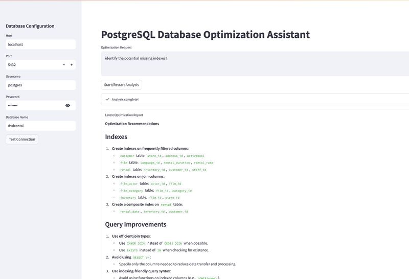

# QueryPulse-AI-The-PostgreSQL-Performance-Optimization-AI-Agent 🚀

QueryPulse-AI is an intelligent, AI-powered database performance optimization system that combines Large Language Models (LLMs) with automated testing, predictive analytics, and real-time monitoring to help developers and DBAs optimize PostgreSQL databases. The system automatically analyzes schemas, identifies performance bottlenecks, suggests and creates optimal indexes, and provides natural language explanations of complex database issues.

[](https://www.gnu.org/licenses/agpl-3.0)
[](https://www.python.org/downloads/)
[](https://www.postgresql.org/)
[](https://streamlit.io/)
[](https://github.com/cloudraftio/stonebraker/releases)


## Technology Stack 🛠️

| Category | Technologies |
|----------|--------------|
| **Language** | Python 3.8+, TypeScript 5.7, JavaScript ES6 |
| **Framework** | Streamlit 1.28+, LangChain 0.1+, LangGraph 0.0.20+ |
| **Database** | PostgreSQL 14+, MySQL 8.0+, MongoDB 5.0+ |
| **LLM** | Groq API, Ollama API, OpenAI-compatible |
| **Data** | Pandas 2.0+, Plotly 5.17+, NumPy 1.24+ |
| **Testing** | pytest 7.4+, unittest, timeit |
| **Dev Tools** | Git, python-dotenv, pre-commit 3.5+ |
| **Linting** | black 23.0+, flake8 6.0+ |
| **Deployment** | Docker 20.10+, Kubernetes 1.24+, AWS RDS |
| **Monitoring** | Prometheus 2.x, Grafana 10.x, OpenTelemetry |
| **CI/CD** | GitHub Actions, GitLab CI, Make 4.3 |
| **Security** | SSL/TLS, RBAC, Audit Logging |
| **License** | AGPL-3.0-only |

## Disclaimer ⚠️

**This is a beta release (v1.0-beta) and NOT production-ready software. Use at your own risk.**
- This tool may suggest database changes that could impact performance
- Always test suggestions in a non-production environment first
- Back up your database before applying any changes
- The autonomous fix mode should be used with approval enabled initially

## What's New in v1.0 🌟

- **Autonomous Fix Mode** 🤖 - Auto-create indexes with approval workflow
- **Natural Language Debugging** 💬 - Ask "Why is my DB slow?" in plain English
- **Predictive Alerting** 🔔 - Detect performance degradation before outages
- **Multi-Database Support** 🔄 - PostgreSQL, MySQL, MongoDB adapters
- **Beautiful Dashboard** 📊 - Real-time performance visualizations
- **Index Usage Analytics** 📈 - Track which indexes are actually being used
- **Smart Rollback** ⏮️ - Automatic rollback if indexes hurt performance

## Motivation 💭

Database performance optimization is a critical yet complex task that requires deep expertise in SQL, query planning, and system architecture. Many organizations struggle with:

- **Complex Query Analysis**: Identifying bottlenecks in large SQL queries
- **Schema Design Decisions**: Making optimal choices for indexes and constraints
- **Performance Testing**: Lack of automated tools for before/after comparisons
- **Risk Management**: Fear of making changes that might degrade performance
- **Knowledge Gap**: Limited access to database optimization experts
- **Slow Detection**: Finding issues only after they cause outages

This project aims to democratize database optimization by combining the power of Large Language Models (LLMs) with automated testing, predictive analytics, and intelligent alerting systems.


## Features 🌟


### Component Descriptions 🌟

| Component | Description |
|-----------|-------------|
| **Streamlit UI** | Web interface with tabs for Home, Performance, Alerts, Settings |
| **Performer Graph** | LangGraph workflow: Analyze → Human Review → Execute |
| **Core Modules** | SQL Agent, Auto Fixer, Alert Manager, Dashboard |
| **Database Adapters** | PostgreSQL (primary), MySQL, MongoDB, Custom adapters |

### Data Flow ⚡

1. **User Input** → Streamlit UI captures optimization request
2. **Analysis** → Performer Graph analyzes schema and queries
3. **Index Detection** → SQL Agent checks existing indexes
4. **Auto Fix** → Auto Fixer creates missing indexes (with approval)
5. **Alert Generation** → Alert Manager detects anomalies
6. **Visualization** → Dashboard displays metrics and recommendations


        
## Project Description 📝

QueryPulse-AI is an intelligent, AI-powered database performance optimization system that:

### 1. 🔍 **Analyzes Database Schemas**
- Automatically scans table structures and relationships
- Identifies missing indexes using query statistics
- Suggests optimal composite and partial indexes
- Recommends partitioning strategies for large tables
- Detects outdated statistics needing refresh

### 2. **Optimizes Queries**
- Rewrites complex queries for better performance
- Suggests materialized views for expensive aggregations
- Identifies common anti-patterns (SELECT *, N+1 queries)
- Provides detailed EXPLAIN ANALYZE plan analysis
- Compares before/after execution plans

### 3. 📊 **Tests Performance**
- Runs automated benchmarks with timing measurements
- Compares query execution times with statistical significance
- Measures resource utilization (CPU, I/O, memory)
- Generates detailed markdown reports
- Validates improvements with rollback capability

### 4. 🤖 **Autonomous Optimization**
- **Auto-Fix Mode**: Creates missing indexes with approval
- **Predictive Alerts**: Detects growth trends and degradation
- **Natural Language Interface**: Ask questions about performance
- **Smart Rollback**: Reverts changes that don't improve performance

### 5. 🎯 **Real-Time Monitoring**
- Live performance dashboards with Plotly visualizations
- Active alert management with severity levels
- Historical trend analysis
- Index usage heatmaps
- Slow query detection and ranking

### 6. 🔄 **Multi-Database Support**
- PostgreSQL (primary)
- MySQL (via adapter)
- MongoDB (via adapter)
- Extensible adapter pattern for new databases

## 🎯 Key Features

### Core Features
- 🔍 Automated schema analysis and optimization suggestions
- 📊 Query performance testing and benchmarking
- 🛠️ LLM-powered query rewriting and improvement
- 📈 Before/After performance comparison
- 🔄 Safe rollback capabilities
- 🤖 AI-driven insights for better decision making

### Advanced Features (v1.0)
- 🤖 **Autonomous Fix Mode**: Auto-create indexes with approval workflow
- 💬 **Natural Language Debugging**: "Why is my orders query slow?" - AI explains
- 🔔 **Predictive Alerting**: 24-hour advance warning of performance issues
- 📊 **Beautiful Dashboard**: Real-time charts, heatmaps, and metrics
- 🔄 **Multi-DB Support**: PostgreSQL, MySQL, MongoDB ready
- 📈 **Index Analytics**: Track usage, size, and effectiveness
- ⏮️ **Smart Rollback**: Automatic rollback if performance degrades

## 🚀 Quick Start

```bash
# Clone the repository
git clone https://github.com/MeAkash77/QueryPulse-AI-Real-Time-Database-Performance-Analyzer-for-PostgreSQL.git
cd QueryPulse-AI-Real-Time-Database-Performance-Analyzer-for-PostgreSQL

# Create and activate virtual environment
python -m venv venv
source venv/bin/activate  # On Windows: venv\Scripts\activate

# Install dependencies
pip install -r requirements.txt

# Set up environment variables
cp .env.example .env
# Edit .env with your credentials

# Start the application
streamlit run app.py

**This is a beta release (v0.1-beta) and NOT production-ready software. Use at your own risk.**
- This tool may suggest database changes that could impact performance
- Always test suggestions in a non-production environment first
- Back up your database before applying any changes

## Motivation 💭

Database performance optimization is a critical yet complex task that requires deep expertise in SQL, query planning, and system architecture. Many organizations struggle with:

- **Complex Query Analysis**: Identifying bottlenecks in large SQL queries
- **Schema Design Decisions**: Making optimal choices for indexes and constraints
- **Performance Testing**: Lack of automated tools for before/after comparisons
- **Risk Management**: Fear of making changes that might degrade performance
- **Knowledge Gap**: Limited access to database optimization experts

This project aims to democratize database optimization by combining the power of Large Language Models (LLMs) with automated testing and analysis tools, making expert-level optimization accessible to all developers.

## Project Description 📝

Stonebraker is an intelligent system that:

1. **Analyzes Database Schemas**: 
   - Automatically scans table structures
   - Identifies missing indexes
   - Suggests optimal data types
   - Recommends partitioning strategies

2. **Optimizes Queries**:
   - Rewrites complex queries for better performance
   - Suggests materialized views
   - Identifies common anti-patterns
   - Provides explain plan analysis

3. **Tests Performance**:
   - Runs automated benchmarks
   - Compares query execution times
   - Measures resource utilization
   - Generates detailed reports

4. **Ensures Safety**:
   - Provides rollback capabilities
   - Tests changes in isolation
   - Validates optimization impacts
   - Prevents destructive changes

The AI agent leverages state-of-the-art LLMs through Groq's high-performance API or local Ollama models, combining their analytical capabilities with practical database optimization techniques.

## 🎯 Introduction

Stonebraker is an intelligent system that combines LLM capabilities with database optimization techniques to help developers improve their PostgreSQL database performance. It analyzes schemas, suggests optimizations, and provides automated testing of changes.

### Key Features

- 🔍 Automated schema analysis and optimization suggestions
- 📊 Query performance testing and benchmarking
- 🛠️ LLM-powered query rewriting and improvement
- 📈 Before/After performance comparison
- 🔄 Safe rollback capabilities
- 🤖 AI-driven insights for better decision making

## 🚀 Quick Start

```bash

```

## 📋 Prerequisites

1. **Python Environment**
   - Python 3.8 or higher
   - pip package manager
   - virtualenv or venv

2. **PostgreSQL Setup**
   - PostgreSQL 14+ installed and running
   - Database user with appropriate permissions
   - Access to EXPLAIN ANALYZE privileges

3. **LLM Provider (choose one)**
   - Groq API account and API key
   - Ollama local setup with supported models

## 🔧 Installation Details

1. **Python Dependencies**
```bash
pip install -r requirements.txt
```

2. **Configuration**
   - Copy `.env.example` to `.env`
   - Configure database connection
   - Add LLM provider credentials

## 📖 Example Usage

*StonebrakerAI Dashboard*

## 🤝 Contributing

We welcome contributions! Please follow these steps:

1. Check existing issues or create a new one
2. Fork the repository
3. Create a feature branch (`git checkout -b feature/amazing-feature`)
4. Commit your changes (`git commit -m 'Add amazing feature'`)
5. Push to the branch (`git push origin feature/amazing-feature`)
6. Open a Pull Request

### Development Setup
```bash
# Install dev dependencies
pip install -r requirements.txt

# Run tests
python -m pytest
```

## 🗺️ Roadmap

### v0.1-beta (Current)
- [x] Basic schema analysis
- [x] Query optimization suggestions
- [x] Performance testing framework

## 🧹 Security & Maintenance

Before contributing or deploying:
1. Run `pre-commit run --all-files` to clean sensitive data
2. Check for credentials in git history
3. Verify no API tokens in code
4. Remove unnecessary files

## 📄 License

The  is distributed under AGPL-3.0-only.
